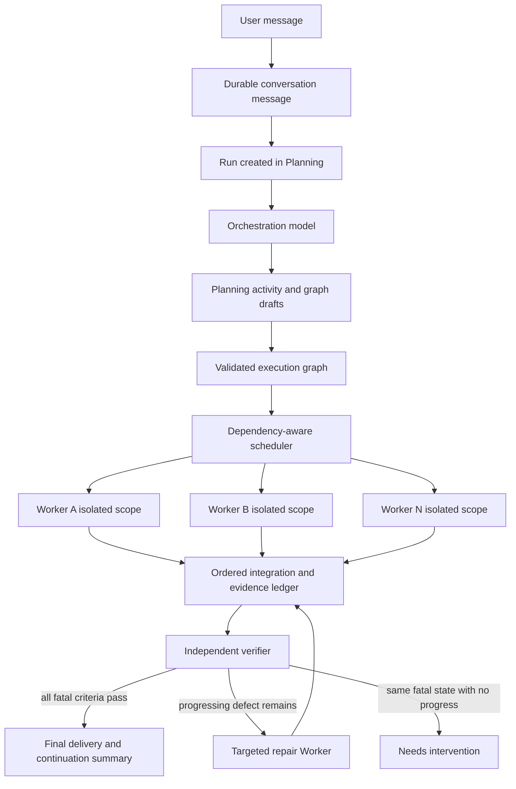
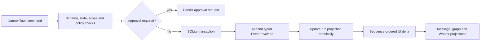
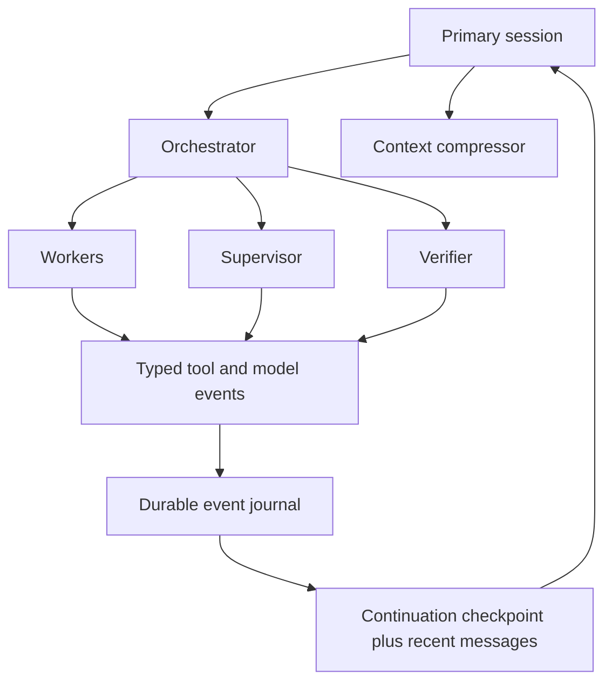
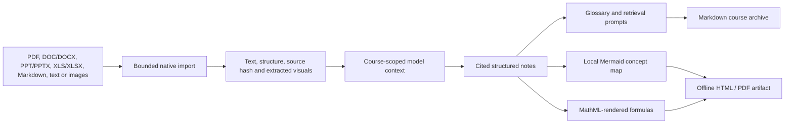

# LunaScope

**The Moonwatcher Project / 望月者计划**

Windows-first local agent workbench for long-running, observable, multi-model work.

[简体中文](README.zh-CN.md) · [Download 0.3.1](https://github.com/LagrangeNSS/LunaScope/releases/tag/v0.3.1) · [Architecture](docs/AGENT_RUNTIME_ARCHITECTURE.md) · [Security model](docs/THREAT_MODEL.md) · [Third-party notices](docs/THIRD_PARTY_NOTICES.md)

LunaScope is built for the part after a model says “I can do that.” It turns a conversation into a durable run, gives the model bounded native tools, decomposes complex work into reviewable Workers, keeps file effects and evidence visible, and continues through verification and targeted repair. Version 0.3.1 is a public engineering preview: it is a runnable Windows desktop application with a Rust execution core, not a finished commercial release.

## Release 0.3.1

| Download | Link |
|---|---|
| Windows installer | [`LunaScope_0.3.1_x64-setup.exe`](https://github.com/LagrangeNSS/LunaScope/releases/download/v0.3.1/LunaScope_0.3.1_x64-setup.exe) |
| Portable executable | [`lunascope-desktop.exe`](https://github.com/LagrangeNSS/LunaScope/releases/download/v0.3.1/lunascope-desktop.exe) |
| SHA-256 checksums | [`SHA256SUMS.txt`](release/v0.3.1/SHA256SUMS.txt) |
| Release notes | [`RELEASE_NOTES.md`](release/v0.3.1/RELEASE_NOTES.md) |

The Windows binaries are currently unsigned. Windows may show a SmartScreen warning; verify the checksum before running them.

### What changed

- Reworked orchestration into a durable, controllable run that begins before planning and survives through execution, verification, repair, pause, guidance, and cancellation.
- Added fine-grained graph planning, bounded parallel Workers, isolated write scopes, dynamic supervision, continuous slot refill, and acceptance-criterion evidence.
- Rebuilt the orchestration canvas with stable typed geometry, pan/zoom, minimap, topology-aware layout, incremental state updates, and DPI-safe fitting.
- Unified the message stream around typed Agent sessions, model-authored public summaries, first-class tool events, Worker traces, and durable conversation continuity.
- Added OpenAI Responses, OpenAI Chat Completions, Anthropic Messages, and generic compatible transports with model/effort capability testing.
- Added independent vision routing for text-only primary models, bounded local browser acceptance, five-step transport retry, and progress-sensitive verifier repair without a fixed generation cap.
- Expanded UltraNote into a project-level course workflow with document ingestion, course memory, cited notes, bilingual terminology, local Mermaid and math rendering, and offline PDF export.
- Added the optional desktop Companion system with pinned Live2D/Spine catalog workflows and explicit asset-license handling.

## Product map

LunaScope keeps the interface compact, but the runtime underneath is deliberately explicit:

- **Projects and conversations** — one project can bind several folders while one chosen workspace defines the writable boundary. Conversations and task-ending summaries are stored in SQLite.
- **Agent execution** — native read, create, guarded patch, process, search, browser-verification, Skill, MCP, and bounded self-management tools.
- **Dynamic orchestration** — task-derived Worker names, owned acceptance criteria, explicit dependencies, write scopes, parallel groups, verifier coverage, and safe graph revision.
- **Observable work** — model-authored public reasoning summaries when available, tool request/result pairs, file changes, verification evidence, current Worker state, and final delivery.
- **Model routing** — multiple providers can be saved together and assigned independently to orchestration, vision, and Worker workloads.
- **Skills and MCP** — system and user Skills live in separate fixed stores, are selected dynamically, and can be imported from a pinned GitHub revision through quarantine inspection.
- **UltraNote** — course-aware notes and study artifacts built from uploaded material rather than an isolated chat mode.
- **Desktop Companion** — optional local character window with model-library and avatar workflows; it is independent of the Agent execution contract.

## Architecture

### One durable run



A Run exists before the first remote planning request. The same cancellation token, pause gate, guidance queue, event sequence, and project/thread identity are used throughout the lifecycle. A new message during stable execution becomes durable guidance: completed effects remain, queued work can be replaced, and active Workers receive the change at a safe model boundary.

### Event-sourced execution



Rust domain types are the canonical contract. Events are append-only and schema-versioned; TypeScript declarations and JSON Schema are generated from those types. SQLite runs in WAL mode. Tool side effects use a persisted request/result lifecycle and an idempotency key, and child processes are owned so cancellation can terminate the process tree.

### Agent sessions and context



The UI does not expose or invent hidden chain-of-thought. It shows Provider-authored public summaries or explicit model commentary, then keeps actual shell, file, browser, permission, verification, and error events as separate evidence. User messages and final task summaries remain in the conversation ledger; context compression adds a checkpoint without deleting the source messages.

## Dynamic multi-Agent orchestration

The Orchestration model acts like a technical lead, not a static role picker. Its first request can report progress, update a draft, and submit the final graph. Local gates reject broad assignments, missing acceptance ownership, write conflicts, cycles, and unverified requirements.

Each ordinary Worker should own one reviewable module, function cluster, asset group, migration, test cluster, or bounded defect. The contract supports up to 24 Workers, a maximum parallel width of eight, task-derived names, dependencies, expected artifacts, acceptance criteria, and explicit write scopes. Independent nodes can run together; overlapping writers are ordered. The scheduler fills a freed slot immediately instead of waiting for a whole batch.

Supervision consumes bounded event deltas rather than repeatedly sending the entire project back to a model. It may guide an active Worker or revise work that has not started, but it cannot reopen completed nodes, repeat successful side effects, expand permissions, or override cancellation.

Transport retry and project repair are separate:

- side-effect-free Provider requests can retry after 2, 5, 10, 20, and 40 seconds;
- verifier repair has no fixed generation limit while files, tests, or evidence continue to improve;
- three generations with the same fatal-defect fingerprint and no evidence of progress pause as `NeedsIntervention` instead of burning resources indefinitely.

## Providers and model routing

Provider identity and wire protocol are configured separately. This lets official endpoints and many relay services use the same typed runtime.

| Transport | Typical configurations |
|---|---|
| OpenAI Responses | OpenAI and compatible relay endpoints |
| OpenAI Chat Completions | DeepSeek, GLM, Kimi/Moonshot, Qwen, Grok/xAI, OpenAI-compatible relays |
| Anthropic Messages | Anthropic and compatible relay endpoints |

Multiple Provider configurations may be stored at once. Orchestration, Vision, and Worker assignments can use different Provider/model pairs. A custom Provider-native reasoning-effort value is saveable only after the exact Provider, model, credential reference, and effort tuple passes a real connection test in the current desktop session. Blank effort means the Provider default.

When the selected primary model cannot inspect an image, LunaScope can route bounded visual input to an independently configured vision model and pass inert, question-focused visual evidence back to the text model. Vision is loaded only when visual work is present and fails closed if no safe route exists.

Credentials are referenced by ID and resolved through Windows Credential Manager. Secret values are not stored in project JSON, events, logs, README files, or the WebView.

## UltraNote

UltraNote is LunaScope’s course and document learning workflow. It is not a separate model mode. In a general project, `/ultranote` activates it for the current request. When a project is created as an UltraNote project, every conversation automatically receives the same persisted course context without requiring the command.

### Course foundation

An UltraNote project starts with:

1. a course name;
2. an optional course code;
3. an uploaded syllabus;
4. an optional user-defined note specification.

The Orchestration model extracts only supported course structure, objectives, dates, policies, and ambiguities. Missing exam dates or AI policies stay unresolved instead of being guessed. Syllabus revisions, course-thread bindings, note sources, citation anchors, review items, and continuation state are isolated by course in SQLite.

### From source material to study artifact



| Input | Current handling |
|---|---|
| PDF | Native bounded text extraction; visual pages can use the configured multimodal route |
| DOCX, PPTX, XLSX | Native OOXML structure extraction plus allowlisted embedded images |
| DOC, PPT, XLS | Accepted as document categories; extraction depends on the supported native parser path |
| Markdown and text | Direct bounded UTF-8 ingestion with source anchors |
| Images | Native multimodal input or independent vision fallback |

Imported content is treated as untrusted source data, not as a higher-priority instruction. File count, individual bytes, total bytes, extracted text, and image payloads are bounded before they reach a model.

### Note rules

- The selected reply language controls the note’s main language. When the source uses another language, specialist or difficult terms may retain the original English in parentheses, followed by a glossary when useful.
- Notes prioritize the learning artifact itself: goals, prerequisites, explanations, formulas, worked examples, evidence, summary, retrieval questions, and glossary where applicable. Export does not add a chat transcript or explanatory wrapper.
- Source claims retain provenance labels and citation anchors. Instructor emphasis is never asserted without a source anchor.
- Mathematical material defines symbols, units, assumptions, domains, and boundary cases. Supported LaTeX is rendered locally to MathML for printable output.
- Mermaid is used when a concept map materially improves structure. The runtime and theme are bundled locally; no CDN is required.
- Custom note specifications control presentation, not provenance, course isolation, unresolved-policy handling, or academic-integrity boundaries.
- Graded or policy-unknown assignments never receive a direct submittable-answer mode.

### Interactive and printable notes

For visual-note requests, an Agent can create an offline interactive HTML page with local assets, responsive layout, diagrams, formulas, and task-appropriate controls. Browser acceptance runs against a bounded temporary copy with network access closed by default. UltraNote PDF export converts note Markdown into a local print document, renders bundled Mermaid and KaTeX/MathML assets, waits for rendering, and asks installed Microsoft Edge to print the final PDF without headers or footers.

This pipeline intentionally keeps both the source Markdown and generated HTML available when PDF rendering cannot complete. PDF output therefore depends on a supported Windows installation with Microsoft Edge.

## Tools, permissions, Skills and MCP

The WebView never receives an arbitrary “execute anything” command. Native commands validate schema, run state, path, project scope, permission mode, and policy before performing work.

- **Request approval** asks before sensitive mutations.
- **Self approval** permits ordinary in-scope work while retaining hard denials.
- **Full access** adds bounded LunaScope self-management such as inspecting safe settings and importing a Skill; it still cannot reveal credentials or execute imported install hooks.
- **Bypass mode** changes approval behavior inside the chosen scope, not the hard security boundary.

System Skills and user Skills are stored separately outside the workspace. GitHub imports are pinned, inspected in quarantine, inventoried, and installed as inert components; scripts and hooks are not executed during inspection or installation. MCP configurations use typed transports and credential references rather than literal authorization secrets.

## Repository structure

```text
LunaScope/
├─ apps/desktop/                       Tauri host, desktop UI and Companion
│  ├─ src/                             TypeScript runtime projections and UI
│  └─ src-tauri/                       Rust commands, ACL, resources and bundling
├─ crates/
│  ├─ lunascope-core/                  Canonical contracts and state machines
│  ├─ lunascope-storage/               SQLite event, conversation and course stores
│  ├─ lunascope-integrations/          Provider protocols, credentials and routing
│  ├─ lunascope-extensions/            Skills, MCP and safe GitHub import
│  └─ lunascope-runtime/               Scheduler, tools, worktrees, browser and UltraNote
├─ packages/runtime-contract/          Generated TypeScript and JSON Schema
├─ prompts/                            LunaScope and role-specific harness prompts
├─ evals/                              Release-evaluation definitions
├─ scripts/                            Repository validation helpers
├─ docs/                               Architecture, decisions, risks and notices
├─ release/v0.3.1/                     Release notes and checksums
├─ indexV14.html                       Product/UX semantic reference
└─ README.md / README.zh-CN.md         English and Chinese documentation
```

`indexV14.html` is a product/UX reference, not proof that a runtime capability exists.

## Install and build

### Install the Windows release

1. Download the [0.3.1 installer](https://github.com/LagrangeNSS/LunaScope/releases/download/v0.3.1/LunaScope_0.3.1_x64-setup.exe).
2. Compare its SHA-256 value with [`release/v0.3.1/SHA256SUMS.txt`](release/v0.3.1/SHA256SUMS.txt).
3. Run the installer. If SmartScreen appears, review the publisher warning and checksum before continuing.
4. Add one or more Provider configurations, store the API credential through the desktop settings, and test each selected model/effort tuple before saving routing.
5. Create a project, select its folders and writable workspace, then start a conversation.

### Build from source

Requirements:

- Windows 10 or 11
- Rust stable with Cargo
- Node.js 20 or newer and npm
- Microsoft Edge WebView2 Runtime
- Tauri 2 Windows prerequisites

```powershell
npm ci
cargo run -p lunascope-core --example export_contract
npm run typecheck
npm run contract:check
cargo test --workspace
npm run tauri -- build
```

The installer is generated at `target/release/bundle/nsis/LunaScope_0.3.1_x64-setup.exe`.

## 0.3.1 verification record

The release was built from the public source snapshot with these local gates passing:

- `cargo fmt --all -- --check`
- `cargo clippy --workspace --all-targets -- -D warnings`
- `cargo check --workspace`
- `cargo test --workspace`
- `npm run typecheck`
- `npm run contract:check`
- `npm run test:companion-assets`
- `npm run evals:check`
- `npm run build`
- `npm run tauri -- build`

The deterministic Rust suite passed with no failures. Tests that require paid Provider credentials, explicit user fixture paths, live network access, or a persistent external workspace remain ignored by default. `evals/manifest.json` defines twelve evidence contracts and deliberately reports `defined_not_run`; it is not presented as a fabricated live-evaluation result.

## Security, privacy and current limits

- Workspace access is path-scoped; selecting more folders does not silently make them writable.
- Credentials remain in Windows Credential Manager and are represented by non-secret reference IDs.
- Imported extension content is untrusted, pinned, bounded, and not executed during inspection.
- Browser verification uses a temporary workspace copy, closed-loopback network policy, bounded actions and a process timeout.
- The desktop uses a restricted CSP, narrow Tauri ACLs, the Windows GUI subsystem, and hidden internal child processes.
- LunaScope 0.3.1 is Windows-first and unsigned.
- Provider behavior and relay compatibility can vary; the built-in connection/capability test is the source of truth for a configured endpoint.
- Extended real-provider and multi-hour endurance canaries are not part of the default test command.
- The LunaScope project’s own distribution license has not yet been selected. Do not infer a public license from the repository’s visibility.
- Some bundled research Skills use CC BY-NC 4.0. Review [`docs/THIRD_PARTY_NOTICES.md`](docs/THIRD_PARTY_NOTICES.md) before commercial redistribution.

## Acknowledgements and licenses

LunaScope is independently implemented. The following projects materially informed the architecture or provide pinned, separately licensed resources:

- [OpenAI Codex](https://github.com/openai/codex), Apache-2.0 — event/tool/session architecture reference
- [OpenCode](https://github.com/anomalyco/opencode), MIT — message-flow and provider architecture reference
- [Pi](https://github.com/earendil-works/pi), MIT — compact Agent loop and Provider adapter reference
- [Tauri](https://github.com/tauri-apps/tauri), Apache-2.0/MIT
- [Mermaid](https://github.com/mermaid-js/mermaid), MIT
- [KaTeX](https://github.com/KaTeX/KaTeX), MIT
- [Microsoft MarkItDown](https://github.com/microsoft/markitdown), MIT — document-conversion design reference
- [Anionex codex-vision-proxy](https://github.com/Anionex/codex-vision-proxy), MIT — independent vision-fallback design reference
- [Orchestra Research AI Research Skills](https://github.com/Orchestra-Research/AI-research-SKILLs), MIT
- [Imbad0202 Academic Research Skills](https://github.com/Imbad0202/academic-research-skills), CC BY-NC 4.0
- [Agents365 Mermaid Skill](https://github.com/Agents365-ai/mermaid-skill), MIT
- [Live2D Cubism Web Samples](https://github.com/Live2D/CubismWebSamples), Live2D sample terms
- [PixiJS](https://github.com/pixijs/pixijs), MIT; [pixi-live2d-display](https://github.com/guansss/pixi-live2d-display), MIT; [Spine Runtimes](https://github.com/EsotericSoftware/spine-runtimes), Spine Runtime License

HarmonyOS Sans is used under its bundled license terms. Complete revisions, provenance, licenses, and redistribution notes are recorded in [`docs/THIRD_PARTY_NOTICES.md`](docs/THIRD_PARTY_NOTICES.md) and alongside vendored resources.

## Contributing

Start with the Rust contract boundary, architecture decisions, risk register, and threat model. Changes that weaken credential isolation, tool ordering, durable event semantics, path scope, permission checks, worktree isolation, or independent verification are security-sensitive architecture changes, not ordinary UI refactors.

The repository is public so the implementation can be reviewed and the 0.3.1 Windows build can be reproduced. Project licensing, code signing, and the remaining long-duration release gates are intentionally still explicit work items rather than hidden behind a maturity claim.
