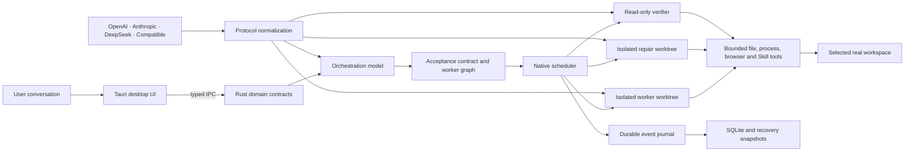
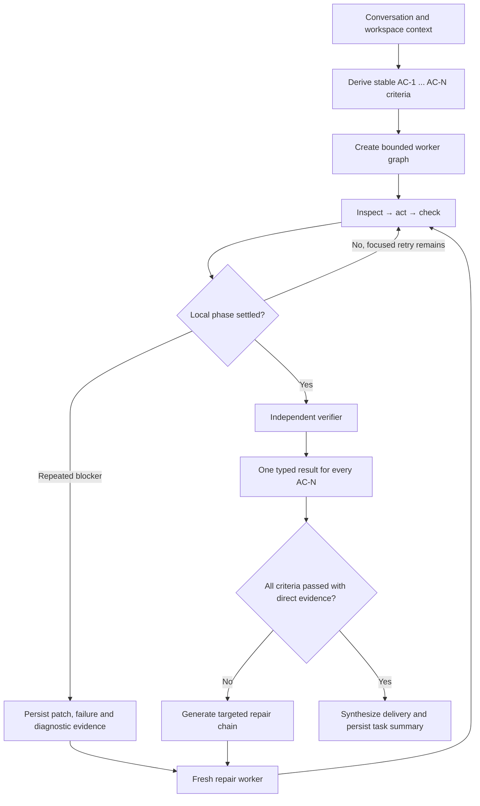
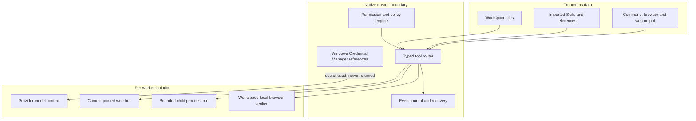

# LunaScope

**The Moonwatcher Project · 望月者计划**

[简体中文](README.zh-CN.md) | English

LunaScope is a Windows-first, local-first agent workbench for people who want an AI agent to do real work instead of stopping at a plan. You start with a conversation and a workspace. LunaScope decides how to approach the task, builds an execution graph when multiple agents are useful, operates on the actual local files, and keeps verification independent from implementation.

Version 0.1.0 is the first public engineering preview. It is already a runnable desktop application with a native Rust execution core, durable conversations, bounded tools, multi-provider model routing, isolated multi-agent work, browser-backed frontend verification, dynamic Skills, MCP integration, and the UltraNote learning workflow. It is not being presented as a finished commercial release: Windows code signing, final product licensing, and several endurance/release gates are still open and documented below.

## Release 0.1.0

| Item | Details |
|---|---|
| Release stage | Public engineering preview |
| Platform | Windows 10/11, x64 |
| Desktop stack | Tauri 2, Rust, TypeScript, native WebView2 |
| Windows installer | [`LunaScope_0.1.0_x64-setup.exe`](https://github.com/LagrangeNSS/LunaScope/releases/download/v0.1.0/LunaScope_0.1.0_x64-setup.exe) |
| Portable executable | [`lunascope-desktop.exe`](https://github.com/LagrangeNSS/LunaScope/releases/download/v0.1.0/lunascope-desktop.exe) |
| Checksums | [`SHA256SUMS.txt`](release/v0.1.0/SHA256SUMS.txt) |
| Release notes | [`RELEASE_NOTES.md`](release/v0.1.0/RELEASE_NOTES.md) |

The installer is currently unsigned. Windows SmartScreen may therefore ask for confirmation. LunaScope also expects the Microsoft Edge WebView2 Runtime, which is included by default on current Windows installations.

## What LunaScope does

- Turns an ordinary conversation into an executable single-agent or multi-agent run.
- Lets the orchestration model choose a small, useful worker graph instead of forcing the user to design one.
- Streams model-authored reasoning summaries, commentary, tool activity, plans, worker state, and verification as separate observable records.
- Reads, creates, and modifies real workspace files through native, scoped tools.
- Executes bounded local commands with timeout, cancellation, output limits, and Windows process-tree cleanup.
- Supports OpenAI, Anthropic, DeepSeek, and compatible provider configurations without limiting the user to one provider.
- Stores provider credentials in Windows Credential Manager rather than project files or the event database.
- Runs workers in isolated Git worktrees and synchronizes reviewed changes back to the selected workspace.
- Preserves task-wide acceptance criteria across delegation, retries, and context compaction.
- Uses an independent verifier and automatically creates a targeted repair chain for fatal or unverified acceptance results.
- Validates local web projects in an installed Edge or Chrome browser with console, runtime, WebGL, shader, Canvas, layout, interaction, and screenshot evidence.
- Loads Codex- and Claude-compatible Skills dynamically from a fixed global Skill store.
- Provides bounded MCP transport, GitHub Skill import, provider routing, pause/resume/cancel, and live guidance replanning.
- Offers UltraNote projects for course-aware notes, document ingestion, bilingual terminology, interactive HTML notes, Mermaid diagrams, mathematics, and offline PDF output.
- Offers an optional native desktop companion that imports local Spine 3.8 or Live2D Cubism models, follows Agent task state, provides metadata-only model search/download/install management, and creates editable Avatar Studio drafts without an extra service or bundled character assets.

## Architecture

LunaScope keeps product state and authority in Rust. The WebView presents the interface; it does not receive arbitrary shell, filesystem, credential, or process access.



### Long-task convergence

Implementation, repair, and verification are different phases with different responsibilities. A builder is allowed to hand over a useful but explicitly unverified implementation when a repeated blocker would otherwise consume the entire context. The repair worker receives the real patch and exact evidence; completed work is not restarted.



### Trust and permission boundary



## Repository structure

```text
LunaScope/
├─ apps/
│  └─ desktop/
│     ├─ src/                         TypeScript desktop interface
│     └─ src-tauri/                   Tauri adapter, native commands and bundled resources
├─ crates/
│  ├─ lunascope-core/                 Canonical domain, events, contracts and state machines
│  ├─ lunascope-storage/              SQLite journal, projections, snapshots and recovery
│  ├─ lunascope-integrations/         Providers, protocol normalization, keyring and routing
│  ├─ lunascope-runtime/              Scheduler, tools, worktrees, browser checks and UltraNote
│  └─ lunascope-extensions/           Skills, GitHub quarantine/import and MCP transports
├─ packages/
│  └─ runtime-contract/               Generated Rust-to-TypeScript IPC contract
├─ prompts/                           LunaScope system and specialized harness prompts
├─ docs/                              Architecture, decisions, threats and third-party notices
├─ release/v0.1.0/                    Local binaries plus tracked checksums and release notes
├─ index.html                         Current desktop UI entry
└─ indexV14.html                      Preserved product/interaction design reference
```

The separation is deliberate. `lunascope-core` does not depend on the UI. Provider-specific wire formats stop at `lunascope-integrations`. Tool execution, permissions, worktree isolation, browser inspection, and scheduling stay in native code. TypeScript consumes generated contracts instead of redefining runtime state by hand.

## Running the public preview

### Installer

1. Download [`LunaScope_0.1.0_x64-setup.exe`](https://github.com/LagrangeNSS/LunaScope/releases/download/v0.1.0/LunaScope_0.1.0_x64-setup.exe).
2. Verify its SHA-256 value against [`SHA256SUMS.txt`](release/v0.1.0/SHA256SUMS.txt).
3. Run the installer and complete the Windows confirmation if SmartScreen appears.
4. Create a project, choose one or more folders, and mark one folder as the workspace.
5. Add at least one provider configuration in Settings. Secrets are saved through the masked native credential flow.

### Portable executable

The portable `lunascope-desktop.exe` is provided for direct evaluation. Keep it in a writable user-owned folder; LunaScope stores runtime state outside the source repository.

## Building from source

### Prerequisites

- Windows 10 or Windows 11, x64
- Rust stable with Cargo
- Node.js 22 or another version supported by Vite 8
- npm
- Microsoft Edge WebView2 Runtime
- Visual Studio Build Tools with the Windows desktop C++ toolchain

### Commands

```powershell
npm ci
npm run contract:check
npm run typecheck
npm run build
cargo fmt --all -- --check
cargo clippy --workspace --all-targets -- -D warnings
cargo test --workspace
npm run tauri -- build
```

To regenerate the canonical frontend contract after changing Rust domain types:

```powershell
cargo run -p lunascope-core --example export_contract
```

Generated TypeScript and JSON Schema files are checked into the repository and validated by the contract test suite.

## Engineering maturity

Version 0.1.0 is not a UI-only prototype. The current source includes and exercises:

| Area | Evidence in the source |
|---|---|
| Runtime state | Versioned Rust events, state machines, typed IPC, snapshots and recovery |
| Multi-agent execution | Dependency scheduling, bounded parallelism, worktree isolation, patch handoff and independent verification |
| Long tasks | Durable context, worker-history compaction, exact-failure retry and evidence-bearing phase handoff |
| Safety | Scoped permissions, hard-denied secret paths, SHA-256 guarded edits, inert imported extensions and process-tree cancellation |
| Provider support | Native OpenAI Responses, OpenAI-compatible/DeepSeek Chat Completions, and Anthropic message normalization |
| Verification | Criterion-level evidence ledger, fatal-defect repair chains, local browser execution and visual/runtime diagnostics |
| Documents | Native PDF and Office extraction, bounded attachment storage, multimodal routing and UltraNote output pipelines |
| Quality gate | Formatting, denied-warning Clippy, full non-ignored Rust workspace tests, contract checks, TypeScript checks and production frontend build |

### Known 0.1.0 limits

- Windows is the only supported desktop platform in this preview.
- The included executables are not code-signed.
- LunaScope's own distribution license has not yet been selected. Public source availability does not grant permissions beyond applicable law; third-party components remain under their own licenses.
- Bundled Imbad0202 academic research Skills use CC BY-NC 4.0. Remove them or obtain separate permission before commercial distribution.
- HarmonyOS Sans SC is resolved from the local Windows installation; font binaries are not redistributed here.
- Signed-release, prolonged endurance, restrictive production CSP, and the remaining domain-pack release matrix are still open.

## Privacy and local data

This public repository does not contain provider keys, `.env` files, Windows credential data, runtime SQLite databases, user workspaces, course material, screenshots from private tasks, browser profiles, logs, caches, or development build directories.

At runtime, provider secrets are referenced through Windows Credential Manager. Imported GitHub content is inspected and commit-pinned before installation; scripts and hooks remain inert unless a separately permissioned execution path exists. Full Access does not return stored credential values to a model or WebView.

For the detailed boundary, see [`docs/THREAT_MODEL.md`](docs/THREAT_MODEL.md) and [`docs/AGENT_RUNTIME_ARCHITECTURE.md`](docs/AGENT_RUNTIME_ARCHITECTURE.md).

## Acknowledgements

LunaScope is independently implemented, but it learned from a strong open-source ecosystem. Major references and bundled components include:

- [Tauri](https://github.com/tauri-apps/tauri), Apache-2.0 / MIT
- [OpenAI Codex](https://github.com/openai/codex), Apache-2.0, architecture reference
- [OpenCode](https://github.com/anomalyco/opencode), MIT, architecture reference
- [Model Context Protocol](https://github.com/modelcontextprotocol), specifications and reference implementations under their respective licenses
- [OpenAI Skills](https://github.com/openai/skills), Apache-2.0
- [Anthropic Skills](https://github.com/anthropics/skills), Apache-2.0
- [obra/superpowers](https://github.com/obra/superpowers), MIT
- [Orchestra Research AI Research Skills](https://github.com/Orchestra-Research/AI-research-SKILLs), MIT
- [Imbad0202 Academic Research Skills](https://github.com/Imbad0202/academic-research-skills), CC BY-NC 4.0
- [K-Dense Scientific Agent Skills](https://github.com/K-Dense-AI/scientific-agent-skills), MIT
- [Agents365 Mermaid Skill](https://github.com/Agents365-ai/mermaid-skill), MIT
- [Mermaid](https://github.com/mermaid-js/mermaid), MIT
- [KaTeX](https://github.com/KaTeX/KaTeX), MIT
- [Microsoft MarkItDown](https://github.com/microsoft/markitdown), MIT, document-conversion design reference

Complete pinned revisions, license notes, font conditions, and redistribution warnings are maintained in [`docs/THIRD_PARTY_NOTICES.md`](docs/THIRD_PARTY_NOTICES.md) and the bundled Skill manifests.

## Project status and contributions

The first public repository is intended to make the architecture reviewable and the 0.1.0 Windows build reproducible. Before opening a contribution, please read the Rust contract boundaries and threat model. Changes that weaken credential isolation, permission checks, durable tool ordering, worktree isolation, or independent verification should be treated as security-sensitive design changes rather than ordinary refactors.

LunaScope is also known in Chinese as **望月者计划**. The name reflects the project's direction: a tool that keeps watching the whole task, not just the next model response.
