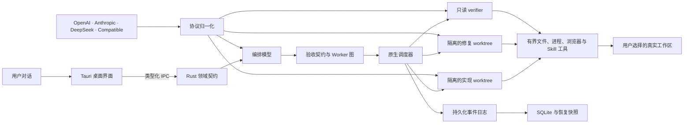
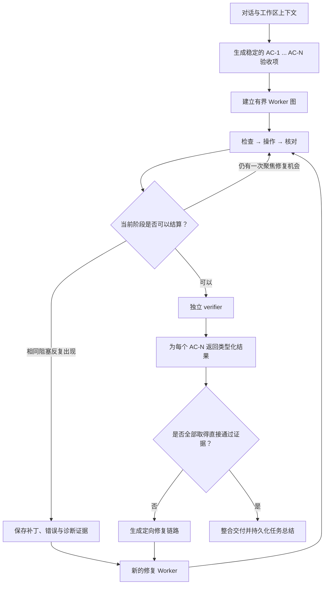
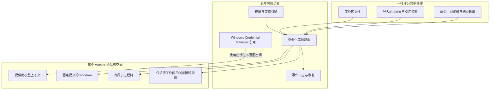

# LunaScope

**望月者计划 · The Moonwatcher Project**

简体中文 | [English](README.md)

LunaScope 是一款 Windows 优先、本地优先的 Agent 工作台。它想解决的问题很直接：用户不应该先学习怎样拆 Agent、画编排图，再把目标转述给每个子 Agent。你只需要进入一个项目、选择工作区，然后像正常对话一样说明要做什么。LunaScope 会判断是否需要多 Agent，建立执行图，在真实本地文件上工作，并把独立验收放在实现之后。

0.1.0 是第一次公开的工程预览版。它已经是可以运行的桌面软件，具备 Rust 原生执行核心、持久化对话、有界工具、多提供商路由、隔离式多 Agent、真实浏览器验收、动态 Skills、MCP 与 UltraNote 学习工作流。不过它还不是一个包装完成的商业正式版：Windows 代码签名、项目最终许可协议和部分长时间发布验收仍待完成。README 会把已完成和未完成的部分分别写清楚。

## 0.1.0 Release

| 项目 | 内容 |
|---|---|
| 发布阶段 | 公开工程预览版 |
| 平台 | Windows 10/11，x64 |
| 桌面技术栈 | Tauri 2、Rust、TypeScript、原生 WebView2 |
| Windows 安装器 | [`LunaScope_0.1.0_x64-setup.exe`](https://github.com/LagrangeNSS/LunaScope/releases/download/v0.1.0/LunaScope_0.1.0_x64-setup.exe) |
| 便携可执行文件 | [`lunascope-desktop.exe`](https://github.com/LagrangeNSS/LunaScope/releases/download/v0.1.0/lunascope-desktop.exe) |
| 校验值 | [`SHA256SUMS.txt`](release/v0.1.0/SHA256SUMS.txt) |
| 发布说明 | [`RELEASE_NOTES.md`](release/v0.1.0/RELEASE_NOTES.md) |

当前安装器尚未进行代码签名，因此 Windows SmartScreen 可能要求用户确认。LunaScope 还需要 Microsoft Edge WebView2 Runtime；当前版本的 Windows 通常已经自带该运行时。

## LunaScope 目前能做什么

- 从普通对话直接开始执行单 Agent 或多 Agent 任务。
- 由编排模型判断是否需要子 Agent，不要求用户自己设计编排。
- 将模型提供的 reasoning summary、自然语言进展、工具状态、计划、Worker 状态和验收记录分开显示。
- 通过 Rust 原生有界工具读取、创建和修改真实工作区文件。
- 执行有超时、取消、输出限制和 Windows 进程树回收的本地命令。
- 同时保存 OpenAI、Anthropic、DeepSeek 和兼容提供商配置。
- 将提供商密钥保存在 Windows Credential Manager，而非项目文件或事件数据库。
- 让 Worker 在隔离的 Git worktree 中执行，再把经过审查的变更同步回真实工作区。
- 在委派、重试和上下文压缩后继续保留任务级验收标准。
- 使用独立 verifier；遇到致命缺陷或未验证验收项时自动生成定向修复链路。
- 使用本机 Edge 或 Chrome 验收网页，获取控制台、运行时、WebGL、shader、Canvas、布局、交互和截图证据。
- 从固定的全局 Skill 目录动态加载 Codex 与 Claude 兼容 Skills。
- 支持有界 MCP、GitHub Skill 导入、模型路由、暂停、继续、取消和运行中引导重规划。
- 提供 UltraNote 项目：课程上下文、文档解析、双语术语、互动 HTML 笔记、Mermaid、数学表达和离线 PDF。

## 架构

LunaScope 把产品状态和权限放在 Rust 中。WebView 负责界面显示，但不会获得任意 Shell、文件系统、凭据或进程权限。



### 长任务如何收敛

实现、修复和验收是三个职责不同的阶段。Builder 如果在同一个问题上反复卡住，可以保留已经完成的真实文件和诊断证据，明确标记为“尚未验收”后交给新的 Repairer，而不是把整轮上下文耗尽。Repairer 会收到真实补丁和精确失败信息，已经完成的操作不会重跑。



### 信任和权限边界



## 源码结构

```text
LunaScope/
├─ apps/
│  └─ desktop/
│     ├─ src/                         TypeScript 桌面界面
│     └─ src-tauri/                   Tauri 适配层、原生命令和内置资源
├─ crates/
│  ├─ lunascope-core/                 领域模型、事件、契约和状态机
│  ├─ lunascope-storage/              SQLite 日志、投影、快照与恢复
│  ├─ lunascope-integrations/         Provider、协议归一化、Keyring 与路由
│  ├─ lunascope-runtime/              调度器、工具、worktree、浏览器与 UltraNote
│  └─ lunascope-extensions/           Skills、GitHub 隔离导入与 MCP
├─ packages/
│  └─ runtime-contract/               从 Rust 生成的 TypeScript IPC 契约
├─ prompts/                           LunaScope 系统提示词和专项 harness
├─ docs/                              架构、决策、威胁模型与第三方声明
├─ release/v0.1.0/                    本地二进制，以及纳入版本控制的校验值与发布说明
├─ index.html                         当前桌面界面入口
└─ indexV14.html                      保留的产品与交互设计参考
```

这种拆分不是为了把目录做得复杂。`lunascope-core` 不依赖 UI；提供商的不同协议在 `lunascope-integrations` 截止；权限、工具、worktree、浏览器和调度留在原生代码中；TypeScript 读取生成契约，而不是重新手写一份运行时状态。

## 运行 0.1.0

### 安装器

1. 下载 [`LunaScope_0.1.0_x64-setup.exe`](https://github.com/LagrangeNSS/LunaScope/releases/download/v0.1.0/LunaScope_0.1.0_x64-setup.exe)。
2. 使用 [`SHA256SUMS.txt`](release/v0.1.0/SHA256SUMS.txt) 核对 SHA-256。
3. 运行安装器；如果出现 SmartScreen，请确认文件来源和校验值后继续。
4. 新建项目，选择一个或多个文件夹，并指定其中一个作为 workspace。
5. 在设置中添加至少一个模型提供商。密钥通过原生遮罩输入保存。

### 便携可执行文件

`lunascope-desktop.exe` 可用于直接评估。建议把它放在用户拥有写权限的普通文件夹中；LunaScope 的运行数据不会写入源码仓库。

## 从源码构建

### 环境要求

- Windows 10 或 Windows 11，x64
- Rust stable 与 Cargo
- Node.js 22，或其他受 Vite 8 支持的版本
- npm
- Microsoft Edge WebView2 Runtime
- 带 Windows 桌面 C++ 工具链的 Visual Studio Build Tools

### 构建命令

```powershell
npm ci
npm run contract:check
npm run typecheck
npm run build
cargo fmt --all -- --check
cargo clippy --workspace --all-targets -- -D warnings
cargo test --workspace
npm run tauri -- build
```

修改 Rust 领域类型后，使用下面的命令重新生成前端契约：

```powershell
cargo run -p lunascope-core --example export_contract
```

生成的 TypeScript 与 JSON Schema 会进入仓库，并由契约测试检查是否和 Rust 主契约一致。

## 工程成熟度

0.1.0 不是只能展示界面的原型。当前源码已经包含并实际覆盖：

| 领域 | 源码中的工程证据 |
|---|---|
| 运行时状态 | 版本化 Rust 事件、状态机、类型化 IPC、快照和恢复 |
| 多 Agent | 依赖调度、有界并发、worktree 隔离、补丁交接和独立验收 |
| 长任务 | 持久化上下文、Worker 历史压缩、精确错误续跑和带证据的阶段交接 |
| 安全 | 有界权限、敏感路径硬拒绝、SHA-256 变更保护、导入扩展惰性处理和进程树取消 |
| 提供商 | OpenAI Responses、OpenAI-compatible/DeepSeek Chat Completions、Anthropic 消息协议归一化 |
| 验收 | 逐项证据账本、致命缺陷修复链路、本地浏览器执行和图形/运行时诊断 |
| 文档能力 | 原生 PDF/Office 提取、有界附件、多模态路由和 UltraNote 输出链路 |
| 质量门槛 | 格式化、Clippy 零警告、完整非忽略 Rust workspace 测试、契约检查、TypeScript 检查和生产前端构建 |

### 0.1.0 已知限制

- 当前只支持 Windows 桌面端。
- Release 尚未进行代码签名。
- LunaScope 自身的发行许可协议尚未确定。公开源码不代表自动授予法律允许范围之外的使用权；第三方组件继续遵循各自许可证。
- 内置的 Imbad0202 学术研究 Skills 使用 CC BY-NC 4.0；商业发行前必须移除或取得单独许可。
- HarmonyOS Sans SC 从本机 Windows 字体中读取，本仓库不重新分发字体文件。
- 签名发布、长时间耐久性测试、严格生产 CSP 和剩余 Domain Pack 发布矩阵仍待完成。

## 隐私与本地数据

这个公开仓库不包含模型密钥、`.env`、Windows Credential 数据、运行时 SQLite 数据库、用户 workspace、课程资料、私人任务截图、浏览器 profile、日志、缓存或开发构建目录。

实际运行时，提供商密钥通过 Windows Credential Manager 引用。GitHub 导入内容会先隔离检查并固定 commit；脚本与 hooks 保持惰性，除非未来存在单独授权的执行路径。即便开启 Full Access，模型和 WebView 也不会拿到已经存储的凭据值。

详细边界见 [`docs/THREAT_MODEL.md`](docs/THREAT_MODEL.md) 与 [`docs/AGENT_RUNTIME_ARCHITECTURE.md`](docs/AGENT_RUNTIME_ARCHITECTURE.md)。

## 开源项目引用与致谢

LunaScope 是独立实现的项目，但它从优秀的开源生态中学到了很多。主要参考和内置组件包括：

- [Tauri](https://github.com/tauri-apps/tauri)，Apache-2.0 / MIT
- [OpenAI Codex](https://github.com/openai/codex)，Apache-2.0，架构参考
- [OpenCode](https://github.com/anomalyco/opencode)，MIT，架构参考
- [Model Context Protocol](https://github.com/modelcontextprotocol)，规范及参考实现遵循各自许可证
- [OpenAI Skills](https://github.com/openai/skills)，Apache-2.0
- [Anthropic Skills](https://github.com/anthropics/skills)，Apache-2.0
- [obra/superpowers](https://github.com/obra/superpowers)，MIT
- [Orchestra Research AI Research Skills](https://github.com/Orchestra-Research/AI-research-SKILLs)，MIT
- [Imbad0202 Academic Research Skills](https://github.com/Imbad0202/academic-research-skills)，CC BY-NC 4.0
- [K-Dense Scientific Agent Skills](https://github.com/K-Dense-AI/scientific-agent-skills)，MIT
- [Agents365 Mermaid Skill](https://github.com/Agents365-ai/mermaid-skill)，MIT
- [Mermaid](https://github.com/mermaid-js/mermaid)，MIT
- [KaTeX](https://github.com/KaTeX/KaTeX)，MIT
- [Microsoft MarkItDown](https://github.com/microsoft/markitdown)，MIT，文档转换设计参考

完整的固定版本、许可说明、字体条件和再发行提示位于 [`docs/THIRD_PARTY_NOTICES.md`](docs/THIRD_PARTY_NOTICES.md) 与内置 Skill 清单中。

## 项目状态与贡献

第一次公开仓库的目标，是让 LunaScope 的架构可以被审阅，让 0.1.0 Windows 构建可以被复现。提交修改前，建议先阅读 Rust 契约边界和威胁模型。任何削弱凭据隔离、权限判断、持久化工具顺序、worktree 隔离或独立验收的修改，都应当被当作安全架构变更，而不是普通重构。

LunaScope 的中文项目名是 **望月者计划**。这个名字代表它想做的事：持续观察完整任务，而不是只关注模型的下一条回复。
