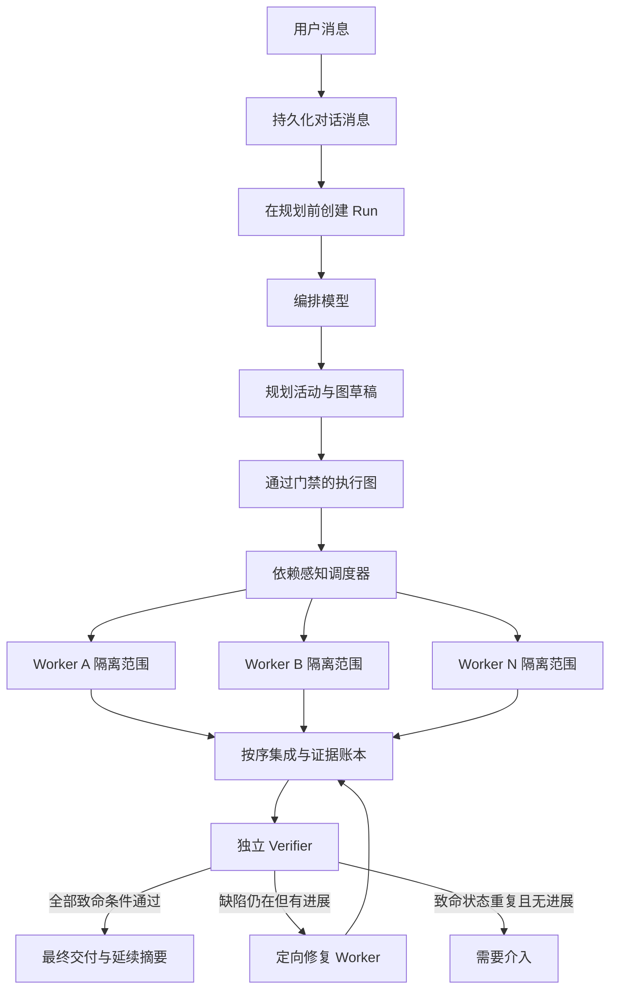
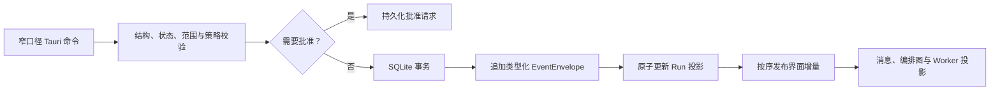
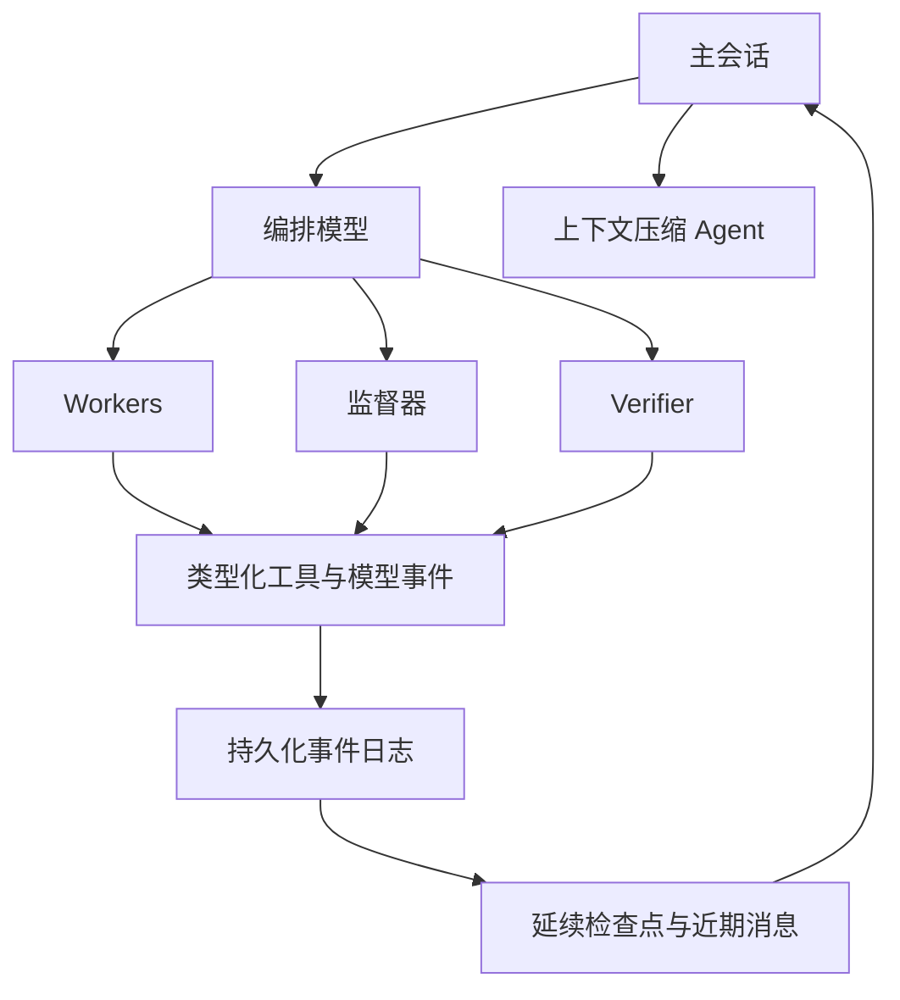
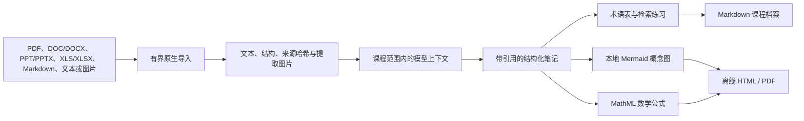

# LunaScope

**望月者计划 / The Moonwatcher Project**

面向 Windows、本地优先，适合长时间运行、过程可观察、多模型协作的 Agent 工作台。

[English](README.md) · [下载 0.3.1](https://github.com/LagrangeNSS/LunaScope/releases/tag/v0.3.1) · [运行架构](docs/AGENT_RUNTIME_ARCHITECTURE.md) · [安全模型](docs/THREAT_MODEL.md) · [第三方声明](docs/THIRD_PARTY_NOTICES.md)

LunaScope 关注的是模型说“我可以做”之后发生的事：把对话转换成可持久化的运行，为模型提供有边界的本地工具，把复杂任务拆成可检查的 Worker，让文件变更与验收证据保持可见，并在验证失败后进行针对性修复。0.3.1 是可运行的 Windows 工程预览版，具备 Rust 原生执行核心，但还不是包装完成的商业正式版。

## 0.3.1 Release

| 下载内容 | 链接 |
|---|---|
| Windows 安装器 | [`LunaScope_0.3.1_x64-setup.exe`](https://github.com/LagrangeNSS/LunaScope/releases/download/v0.3.1/LunaScope_0.3.1_x64-setup.exe) |
| 便携可执行文件 | [`lunascope-desktop.exe`](https://github.com/LagrangeNSS/LunaScope/releases/download/v0.3.1/lunascope-desktop.exe) |
| SHA-256 校验值 | [`SHA256SUMS.txt`](release/v0.3.1/SHA256SUMS.txt) |
| 发布说明 | [`RELEASE_NOTES.md`](release/v0.3.1/RELEASE_NOTES.md) |

当前 Windows 二进制尚未签名。Windows 可能显示 SmartScreen 提示，运行前请先核对校验值。

### 本版变化

- 将编排改造成完整、可控制的持久化 Run：从规划前开始，贯穿执行、验证、修复、暂停、引导与取消。
- 加入细粒度图规划、有界并行 Worker、隔离写入范围、动态监督、空闲槽位持续补位和逐项验收证据。
- 重构编排画布：类型化稳定坐标、自由拖动与缩放、缩略图、拓扑排版、增量状态更新和 DPI 安全的适应视图。
- 以类型化 Agent 会话重构消息流：模型主动公开的摘要、一级工具事件、独立 Worker 链路和持久化对话上下文。
- 支持 OpenAI Responses、OpenAI Chat Completions、Anthropic Messages 与通用兼容传输，并能真实测试模型与思考强度。
- 为纯文本主模型加入独立视觉路由，同时提供有界本地浏览器验收、五次递增传输重试和无固定代数上限的进展式修复。
- 将 UltraNote 扩展为项目级课程工作流：文档导入、课程记忆、引用笔记、双语术语、本地 Mermaid/数学渲染与离线 PDF。
- 加入可选的桌面伙伴系统，支持带许可确认的 Live2D/Spine 模型库与 Avatar 工作流。

## 产品能力

LunaScope 的界面保持克制，但运行内核会把关键事实明确记录下来：

- **项目与对话**：一个项目可以关联多个文件夹，由其中一个明确的 workspace 决定可写边界。对话与任务结束总结长期保存在 SQLite。
- **Agent 执行**：原生读取、创建、保护式修改、进程、搜索、浏览器验收、Skill、MCP 与有界自我管理工具。
- **动态编排**：根据任务生成 Worker 名称、验收条件、依赖、写入范围、并行组、Verifier 覆盖关系与安全图修订。
- **过程可见**：模型主动提供的公开推理摘要、工具请求与结果、文件变更、验收证据、Worker 状态和最终交付。
- **模型路由**：可以同时保存多个提供商，并分别分配给编排、视觉和 Worker。
- **Skills 与 MCP**：系统 Skill 与用户 Skill 存放在 workspace 外的独立固定目录，按需动态选择；GitHub Skill 通过固定版本和隔离检查导入。
- **UltraNote**：从用户上传的课程资料构建课程上下文、笔记和学习材料，而不是另起一个聊天模式。
- **桌面伙伴**：可选的本地角色窗口、模型库与 Avatar 工作流，与 Agent 执行契约相互独立。

## 架构

### 一个贯穿全程的 Run



Run 在第一次远程规划调用前就已存在。规划、执行、验证和修复共用同一个取消令牌、暂停门、引导队列、事件序列和项目/对话身份。稳定运行时发送的新消息会成为持久化引导：已经完成的副作用保持不变，未启动节点可以重排，运行中的 Worker 会在安全的模型边界接收改变。

### 事件溯源执行



Rust 领域类型是唯一契约来源。事件只追加且带有结构版本；TypeScript 声明和 JSON Schema 由 Rust 生成。SQLite 使用 WAL。工具副作用采用持久化请求/结果协议和幂等键；子进程由运行时托管，使取消能够结束整棵进程树。

### Agent 会话与上下文



界面不会暴露或伪造模型隐藏的原始思维链。LunaScope 展示提供商给出的公开摘要或模型明确提交的说明，并把真实 Shell、文件、浏览器、权限、验证和错误事件分别作为证据。用户消息与任务结束总结长期保留；上下文压缩只增加检查点，不删除源消息。

## 动态多 Agent 编排

编排模型承担技术负责人的职责，而不是静态选择几个角色。首个请求即可报告进度、更新草稿并提交正式图。本地质量门禁会拒绝笼统任务、缺失的验收归属、写入冲突、循环依赖和没有验证覆盖的要求。

普通 Worker 应当只负责一个可审查的模块、函数簇、资源组、迁移、测试簇或有边界的缺陷。运行契约最多允许 24 个 Worker，最大并行宽度为 8；每个节点具有任务生成的名称、依赖、预期交付物、验收条件和明确写入范围。彼此独立的节点可以同时运行，范围重叠的写入者会被排序。任一 Worker 完成后，调度器会立即补入新解锁节点，不等待整批结束。

监督器只消费有界事件增量，不会反复把完整项目发给模型。它可以在安全边界引导活动节点，或修改尚未开始的节点，但不能重新打开完成节点、重复成功副作用、扩大权限或覆盖用户取消。

网络传输重试与项目修复是两套不同策略：

- 没有副作用的提供商请求可在 2、5、10、20、40 秒后递增重试；
- 只要文件、测试或证据继续改善，Verifier 修复就没有固定代数上限；
- 如果连续三代同时保持相同致命缺陷指纹且没有任何进展，则暂停为 `NeedsIntervention`，避免无效消耗。

## 提供商与模型路由

LunaScope 把提供商品牌和传输协议分开配置，因此官方接口和大量中转站可以共用同一套类型化运行时。

| 传输协议 | 常见配置 |
|---|---|
| OpenAI Responses | OpenAI 与支持 Responses 的兼容中转站 |
| OpenAI Chat Completions | DeepSeek、GLM、Kimi/Moonshot、Qwen、Grok/xAI 与 OpenAI 兼容中转站 |
| Anthropic Messages | Anthropic 与兼容中转站 |

可以同时保存多个 Provider 配置，并为编排、视觉和 Worker 分配不同的 Provider/模型。自定义原生思考强度只有在当前桌面会话中，使用完全相同的 Provider、模型、凭据引用和强度完成真实连接测试后才能保存；留空表示采用提供商默认值。

当主模型不能理解图片时，LunaScope 可把有界视觉输入发送给独立视觉模型，再将只针对问题、作为普通资料的视觉描述交还文本模型。没有视觉任务时不会提前初始化视觉模型；视觉路由不可用时会明确失败，不会把不受支持的二进制静默发给主模型。

凭据通过引用 ID 指向 Windows Credential Manager。密钥值不会写入项目 JSON、事件、日志、README 或 WebView。

## UltraNote

UltraNote 是 LunaScope 的课程与文档学习工作流，不是独立的模型模式。在普通项目中，使用 `/ultranote` 触发当前请求；如果项目在创建时就选择 UltraNote，则其中每个对话都会自动获得同一份持久化课程上下文，不再需要输入命令。

### 课程基础

创建 UltraNote 项目时需要填写或提供：

1. 课程名称；
2. 可选课程编号；
3. 上传的课程大纲；
4. 可选的个人笔记规范。

编排模型只提取资料支持的课程结构、目标、日期、规则与歧义。没有写明的考试日期、AI 使用政策等内容会保持未解决状态，不会被猜测。大纲修订、课程与对话绑定、笔记来源、引用锚点、复习条目和延续状态都按课程隔离保存在 SQLite 中。

### 从资料到学习成果



| 输入类型 | 当前处理方式 |
|---|---|
| PDF | 原生有界文本提取；可通过配置的多模态链路理解页面图像 |
| DOCX、PPTX、XLSX | 原生提取 OOXML 结构和允许范围内的内嵌图片 |
| DOC、PPT、XLS | 可作为对应文档类别导入，具体提取取决于受支持的原生解析路径 |
| Markdown 与文本 | 以 UTF-8 有界导入，并保留来源锚点 |
| 图片 | 使用主模型原生多模态或独立视觉回退 |

导入内容始终是“不可信资料”，不会成为高于系统规则的指令。在进入模型前，文件数量、单文件大小、总大小、提取文本和图片负载都会经过限制。

### 笔记规则

- 笔记主体使用设置中的模型回复语言。如果原始资料使用另一种语言，专业词与难词可以在括号中补充英文，并在合适时生成词汇表。
- 内容以笔记本身为中心：学习目标、前置概念、核心讲解、公式、例题、证据、总结、检索问题和必要的词汇表。导出物不会附带聊天记录或多余解释。
- 资料性结论保留来源标签与引用锚点。没有来源依据时，不会擅自声称“教师重点强调”。
- 数学内容应定义符号、单位、假设、定义域和边界情况。支持的 LaTeX 在打印输出中本地渲染为 MathML。
- 只有在概念关系确实适合时才使用 Mermaid。运行时和主题随软件本地提供，不依赖 CDN。
- 用户自定义规范只影响呈现方式，不能削弱出处、课程隔离、未解决政策和学术诚信边界。
- 对已评分或政策未知的作业，永远不提供可以直接提交的答案模式。

### 互动笔记与 PDF

用户要求可视化笔记时，Agent 可以生成离线互动 HTML 页面，包括本地资源、响应式排版、图表、公式和适合任务的交互控件。浏览器验收在有界临时副本中运行，默认关闭外部网络。UltraNote 的 PDF 导出会把笔记 Markdown 转换成本地打印文档，使用随包提供的 Mermaid 与 KaTeX/MathML，等待渲染完成后调用已安装的 Microsoft Edge 输出无页眉页脚 PDF。

如果 PDF 渲染失败，系统会保留 Markdown 和 HTML，而不是丢失笔记。因此 PDF 功能依赖受支持的 Windows 环境和 Microsoft Edge。

## 工具、权限、Skills 与 MCP

WebView 不存在“执行任意字符串”的后门。原生命令会先验证输入结构、Run 状态、路径、项目范围、权限模式与策略。

- **请求批准**：敏感修改前询问用户。
- **自我审批**：允许项目范围内的普通工作，同时保留硬性禁止项。
- **完全访问**：增加有边界的 LunaScope 自我管理，例如查看安全设置和导入 Skill；仍不能读取密钥或执行导入项目的安装钩子。
- **Bypass mode**：改变选定范围内的批准行为，不会移除底层安全边界。

系统 Skill 与用户 Skill 分开存放在 workspace 之外。GitHub 导入会固定提交版本、在隔离区检查、生成清单，再把组件作为惰性内容安装；检查与安装期间不会执行脚本或钩子。MCP 配置使用类型化传输和凭据引用，而不是明文 Authorization 值。

## 仓库结构

```text
LunaScope/
├─ apps/desktop/                       Tauri 宿主、桌面界面与桌面伙伴
│  ├─ src/                             TypeScript 运行投影与 UI
│  └─ src-tauri/                       Rust 命令、ACL、资源与打包配置
├─ crates/
│  ├─ lunascope-core/                  核心契约与状态机
│  ├─ lunascope-storage/               SQLite 事件、对话与课程存储
│  ├─ lunascope-integrations/          Provider 协议、凭据与路由
│  ├─ lunascope-extensions/            Skills、MCP 与安全 GitHub 导入
│  └─ lunascope-runtime/               调度器、工具、worktree、浏览器与 UltraNote
├─ packages/runtime-contract/          生成的 TypeScript 与 JSON Schema
├─ prompts/                            LunaScope 与各运行阶段的提示词
├─ evals/                              Release 评测定义
├─ scripts/                            仓库验证脚本
├─ docs/                               架构、决策、风险与第三方声明
├─ release/v0.3.1/                     发布说明与校验值
├─ indexV14.html                       产品/UX 语义参考
└─ README.md / README.zh-CN.md         英文与中文文档
```

`indexV14.html` 只是产品和 UX 语义参考，不能当作某项运行能力已经实现的证据。

## 安装与构建

### 安装 Windows 版本

1. 下载 [0.3.1 安装器](https://github.com/LagrangeNSS/LunaScope/releases/download/v0.3.1/LunaScope_0.3.1_x64-setup.exe)。
2. 使用 [`release/v0.3.1/SHA256SUMS.txt`](release/v0.3.1/SHA256SUMS.txt) 核对 SHA-256。
3. 运行安装器。如果出现 SmartScreen，请先检查发布者提示和校验值。
4. 添加一个或多个提供商配置，通过桌面设置安全保存 API 凭据，并在保存路由前测试每个选定模型/强度组合。
5. 创建项目，选择关联文件夹与可写 workspace，然后新建对话。

### 从源码构建

需要：

- Windows 10 或 Windows 11
- Rust stable 与 Cargo
- Node.js 20 或更高版本和 npm
- Microsoft Edge WebView2 Runtime
- Tauri 2 的 Windows 构建依赖

```powershell
npm ci
cargo run -p lunascope-core --example export_contract
npm run typecheck
npm run contract:check
cargo test --workspace
npm run tauri -- build
```

安装器会生成在 `target/release/bundle/nsis/LunaScope_0.3.1_x64-setup.exe`。

## 0.3.1 验证记录

本次 Release 使用公开源码快照构建，并通过以下本地门禁：

- `cargo fmt --all -- --check`
- `cargo clippy --workspace --all-targets -- -D warnings`
- `cargo check --workspace`
- `cargo test --workspace`
- `npm run typecheck`
- `npm run contract:check`
- `npm run test:companion-assets`
- `npm run evals:check`
- `npm run build`
- `npm run tauri -- build`

确定性的 Rust 测试全部通过。需要付费 Provider 凭据、用户明确提供的测试资料路径、真实网络或持久化外部 workspace 的测试默认保持 ignored。`evals/manifest.json` 只定义了 12 组证据契约，并明确标记为 `defined_not_run`；它不是虚构的真实模型评测结果。

## 安全、隐私与当前限制

- workspace 访问受到路径约束；增加项目文件夹不会悄悄扩大写入范围。
- 凭据保存在 Windows Credential Manager 中，软件内部只记录非敏感引用 ID。
- 导入的扩展内容是不可信、固定版本、有界且在检查阶段不会被执行的资料。
- 浏览器验收使用临时 workspace 副本、封闭回环网络、有界操作和进程超时。
- 桌面端使用限制型 CSP、窄口径 Tauri ACL、Windows GUI subsystem 和隐藏的内部子进程。
- LunaScope 0.3.1 仍是 Windows 优先且未签名的工程预览版。
- 提供商和中转站行为可能不同；内置连接/能力测试才是当前配置能否使用的判断依据。
- 真实 Provider 与多小时耐久 canary 不属于默认测试命令。
- LunaScope 自身的分发许可证尚未确定。不能因为仓库公开就推断出一个开源许可证。
- 部分科研 Skill 使用 CC BY-NC 4.0。商业再分发前请阅读 [`docs/THIRD_PARTY_NOTICES.md`](docs/THIRD_PARTY_NOTICES.md)。

## 致谢与许可

LunaScope 为独立实现。以下项目对架构有重要参考价值，或以独立许可提供了固定版本的资源：

- [OpenAI Codex](https://github.com/openai/codex)，Apache-2.0：事件、工具与会话架构参考
- [OpenCode](https://github.com/anomalyco/opencode)，MIT：消息流和 Provider 架构参考
- [Pi](https://github.com/earendil-works/pi)，MIT：精简 Agent Loop 与 Provider 适配器参考
- [Tauri](https://github.com/tauri-apps/tauri)，Apache-2.0/MIT
- [Mermaid](https://github.com/mermaid-js/mermaid)，MIT
- [KaTeX](https://github.com/KaTeX/KaTeX)，MIT
- [Microsoft MarkItDown](https://github.com/microsoft/markitdown)，MIT：文档转换设计参考
- [Anionex codex-vision-proxy](https://github.com/Anionex/codex-vision-proxy)，MIT：独立视觉回退设计参考
- [Orchestra Research AI Research Skills](https://github.com/Orchestra-Research/AI-research-SKILLs)，MIT
- [Imbad0202 Academic Research Skills](https://github.com/Imbad0202/academic-research-skills)，CC BY-NC 4.0
- [Agents365 Mermaid Skill](https://github.com/Agents365-ai/mermaid-skill)，MIT
- [Live2D Cubism Web Samples](https://github.com/Live2D/CubismWebSamples)，Live2D sample terms
- [PixiJS](https://github.com/pixijs/pixijs)，MIT；[pixi-live2d-display](https://github.com/guansss/pixi-live2d-display)，MIT；[Spine Runtimes](https://github.com/EsotericSoftware/spine-runtimes)，Spine Runtime License

HarmonyOS Sans 按随附许可使用。完整上游版本、来源、许可证和再分发说明请查阅 [`docs/THIRD_PARTY_NOTICES.md`](docs/THIRD_PARTY_NOTICES.md) 以及各 vendored 资源目录中的许可文件。

## 参与开发

请先阅读 Rust 契约边界、架构决策、风险登记和威胁模型。任何削弱凭据隔离、工具顺序、持久化事件语义、路径范围、权限校验、worktree 隔离或独立验证的改动，都属于安全敏感的架构变更，而不是普通 UI 调整。

公开仓库的目的，是让实现可以被审阅，让 0.3.1 Windows 构建可以复现。项目许可证、代码签名和剩余长时间发布门禁仍被明确列为未完成事项，而不是用成熟度宣传掩盖。
